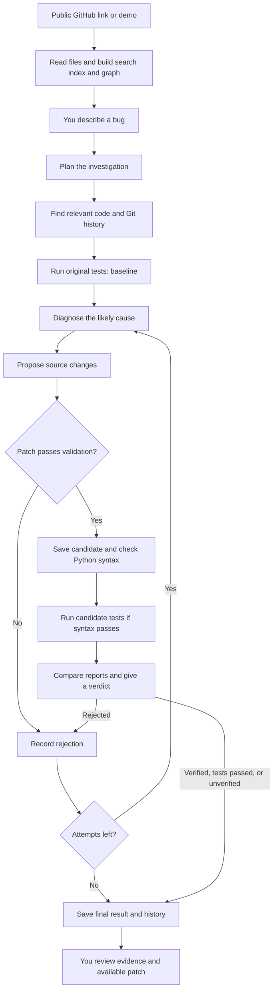
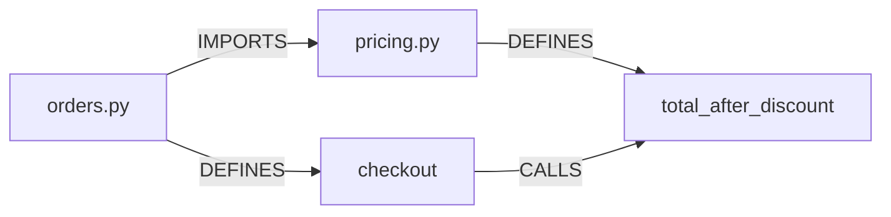
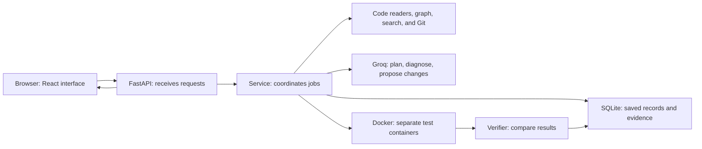

# CodeMind
## Understand a project, investigate a bug, and review a fix

CodeMind is a local web app that helps you understand a code project and investigate bugs. Give it a public GitHub project link and describe what is going wrong. It reads supported files, finds code related to your issue, asks an AI model to suggest changes, and uses automated tests to check the result.

You get an explanation, proposed code changes, test results from before and after the change, and a downloadable **patch**: a text file showing which lines should change. Proposed changes are saved separately. CodeMind does not update your original repository or push to GitHub.

For example, a shop should charge 180 after a 10% discount on 200. The bundled demo incorrectly charges 190. CodeMind shows the relevant calculation, proposes a correction, and checks the existing tests when Docker is available.

You can also use it just to explore files, search code, and see how files connect. AI repair needs a Groq key; testing repairs needs Docker.

### Start on this computer

Dependencies and the frontend build are installed. Double-click **start.cmd**, then open **http://127.0.0.1:8000**. Keep that window open.

The local embedding runtime and MiniLM model have also been installed and enabled in this computer's .env. A fresh installation leaves embeddings optional until configured.

1. Add your Groq key to the local **.env** after `GROQ_API_KEY=`. Get it from [Groq Console](https://console.groq.com/keys). Never commit that file.
2. Start Docker Desktop with Linux containers.
3. Build the test image from this directory: `docker build -t codemind-sandbox:local sandbox`.
4. Restart the backend after changing environment settings.
5. Load the **discount-service demo**, then open **Repair studio**.
6. **Run scripted demo** uses a labelled, predetermined fix. **Investigate with Groq** uses live model-generated planning, diagnosis and changes.

Without a key, analysis/search/demo still work. Without Docker, patches remain **unverified**. The demo contains six tests and a percentage-discount bug.

### Fresh setup

Requires Python 3.12+, Node 22.18+ or 24, Git, and Docker Engine/Desktop.

```powershell
python -m venv .venv
.\.venv\Scripts\python.exe -m pip install --no-cache-dir -r requirements.txt
Copy-Item .env.example .env
npm.cmd --prefix frontend ci --cache frontend/.npm-cache
npm.cmd --prefix frontend run build
docker build -t codemind-sandbox:local sandbox
.\.venv\Scripts\python.exe -m uvicorn backend.main:app --host 127.0.0.1 --port 8000
```

On Linux/macOS, use `.venv/bin/python` and `npm`. Preserve your existing .env during repeated setup. For frontend development, run `npm run dev` inside frontend; its API proxy targets port 8000.

### Docker Compose

```sh
docker compose --profile build-sandbox build
docker compose up codemind
```

Compose publishes only localhost:8000 and persists data in a named volume. The trusted backend receives the Docker socket to create sandbox containers. This grants Docker control: keep it local and single-user. Repository containers never receive that socket, host mounts, API keys or network access.

### Your first investigation

1. Open **Repository**, paste a public GitHub repository URL, and click **Analyze repository**. Alternatively, load the **discount-service demo**.
2. Wait for the repository to become **ready**. CodeMind downloads a separate copy and builds its file list, search index, and relationship map.
3. Click a file in **Architecture map** to open it in **Code explorer**. **Recent changes** shows commits. **Git blame** shows the recorded author and commit for each line.
4. Open **Search & retrieve** and enter a function name or a description such as `discount percentage`. Results show file names, line numbers, and how the code was found. Click a result to read its file.
5. Open **Repair studio**. Describe the actual behavior, expected behavior, and a small example. Choose the Python or JavaScript test profile that matches the repository.
6. Click **Investigate with Groq** for a real AI investigation. On the demo, **Run scripted demo** uses a predetermined plan, diagnosis, and fix without an AI key, while still using the normal checking process.
7. Read **Evidence trail**, **Test evidence**, and **Proposed changes**. The code comparison shows the original and proposed versions. Select another changed file if needed.
8. Read the verdict, then use **Download patch** to save the latest attempt's changes when available. Review the patch before applying it yourself. **Task memory** lets you reopen saved investigations for this repository.

A useful issue description is: “For prices `[100, 100]` and a 10% discount, checkout returns 190. It should return 180. Keep the existing input validation.” A broad request such as “fix everything” gives the system too little direction.

### How a repair works

**Baseline** means the original code before a change. **Candidate** means a proposed changed copy. A **test** is an automatic check of expected behavior.



1. **Read the project.** CodeMind clones the public repository or creates the demo. It reads supported text files without running the imported code on your computer. Generated folders, common secret files, unsupported files, and files over the size limits are skipped.
2. **Build a map and searchable pieces.** Code readers identify supported functions, classes, and their connections. Text is split into pieces of up to 80 lines, sharing 20 lines with the next piece to preserve nearby context. Every piece keeps its file and line numbers.
3. **Plan.** Groq receives the issue, repository summary, and up to five saved experiences for this imported repository. It returns a summary, investigation steps, and up to four search queries. Application code controls the actual stages; the plan is not a shell script.
4. **Gather evidence.** Searches find relevant code and can add connected files. The workflow keeps up to 12 code pieces, reads recent commits, and includes short change excerpts from the two latest commits.
5. **Test the original.** The selected test runner runs the original indexed files in Docker. This records what already passes and fails, when the environment is available.
6. **Diagnose.** The debugger receives selected code, baseline output, Git history, and earlier attempt feedback. It returns a likely cause, file-and-line references, and what remains uncertain. Its explanation is a hypothesis to review.
7. **Propose a change.** The coder receives up to six complete selected files and returns replacement file contents with an explanation. CodeMind rejects invalid paths, protected test/configuration edits, unsupported or oversized changes, unchanged patches, and invalid Python syntax. Accepted candidates are saved separately, then all candidate Python files receive a syntax check.
8. **Test and compare.** If syntax passes, the candidate runs with the same test profile in a fresh Docker container. The verifier compares test reports using fixed Python rules. Groq does not choose the verdict.
9. **Retry or finish.** Rejected attempts can trigger another diagnosis and patch, up to three attempts total. Each candidate starts from the original files and uses previous feedback; patches do not accumulate. `verified`, `tests_passed`, and `unverified` end the loop. A provider or other workflow error can stop work earlier.
10. **Remember and review.** SQLite saves task records and events. Completed investigations also save approaches and outcomes for later planning. You review the evidence and the latest attempt's patch.

### The demo, from mistake to fix

The demo has `pricing.py` for discounts, `orders.py` for checkout, and six tests covering percentage discounts, no discount, full discount, invalid input, checkout, and an empty cart.

| Step | What happens |
|---|---|
| Input | Prices are `[100, 100]`; the discount is 10%. |
| Original calculation | `200 - 10 = 190`: it subtracts 10 as money. |
| Expected calculation | `200 * (1 - 10 / 100) = 180`: it subtracts 10% of the total. |
| Proposed change | Replace `subtotal - discount_percent` with `subtotal * (1 - discount_percent / 100)`. |
| Evidence to inspect | Original failing tests now pass, and original passing tests still pass. |

With the prepared Docker environment, the intended demo result is six passing candidate tests and a `verified` verdict. Without Docker, the scripted patch can still be shown, but its verdict is `unverified`. The scripted demo demonstrates the process; it does not show an AI discovering the bug.

### What the graph means

A **graph** is a map of things and their connections. A **node** is a file, function, or class. An **edge** connects two nodes. A function is a named piece of code that does a job; a class groups related data and behavior.

| Connection | Plain meaning | Example |
|---|---|---|
| `DEFINES` | This file contains this function or class. | `pricing.py` contains `total_after_discount`. |
| `IMPORTS` | This file brings in code from another file. | `orders.py` imports code from `pricing.py`. |
| `CALLS` | This code uses another function. | `checkout` calls `total_after_discount`. |
| `INHERITS` | This class builds on another class. | A Python `Child` class extends a `Base` class. |



This helps when a bug crosses file boundaries: checkout shows the wrong total, but the calculation lives in another file. Hybrid search follows connections from its top matches and can add a first code piece from related files.

The browser's **Architecture map** shows file-import connections among the first 24 files. The backend graph also includes extracted functions, classes, and other relations; the graph API exposes that fuller map. The diagram above illustrates the fuller graph.

CodeMind reads code structure rather than watching a running program. Python uses its built-in AST parser; an AST is a structured representation of code. JavaScript and TypeScript use Tree-sitter, another code parser. Python inheritance is extracted, but dynamic calls, ambiguous names, and some JavaScript/TypeScript patterns can be missed. Other supported text files can be searched without receiving the same structural analysis.

### How search finds useful code

| Search option | How it works |
|---|---|
| **BM25 only** | Matches words and identifiers in file paths and code. It considers word frequency and how common a word is across the project. Useful for names such as `discount_percent`. |
| **Semantic only** | An optional local model turns code and questions into lists of numbers called embeddings. Similar lists suggest related meaning even when wording differs. Returns no results when embeddings are unavailable. |
| **Hybrid** | Combines keyword and available semantic rankings, then adds related files from the graph. Without embeddings, it uses BM25 and graph connections. |

The ranking combiner is called **reciprocal-rank fusion**: a result earns points based on its position in each search list. A result near the top of both lists can rank higher. These scores order results; they are not probabilities that a file contains the bug.

Groq generates planning and coding text. The optional embedding model runs locally through FastEmbed/ONNX. They have different jobs. The graph, BM25, ranking combination, task coordination, memory, and verifier are implemented directly in this project, without LangChain or CrewAI.

### What each tool does



| Tool or component | Its job here |
|---|---|
| React + TypeScript | Build browser screens and update them as work progresses. |
| Vite | Runs frontend development and builds browser files. |
| Monaco | Shows source code and side-by-side changes in read-only editors. |
| FastAPI + Uvicorn | Receive browser requests and serve the built app locally. An API is the set of requests the browser uses to communicate with the backend. |
| Pydantic | Checks request and AI-response fields. Structured JSON is a response with named fields that the program can validate. |
| `service.py` | Coordinates stages, background jobs, retries, and saved results. |
| Planner, debugger, coder | Three AI roles using the same configured Groq client: decide where to look, explain the likely cause, and propose a change. |
| Git | Downloads the project and reads recorded changes and line history. |
| Python AST + Tree-sitter | Extract supported code definitions and relationships. |
| BM25 + optional FastEmbed/ONNX + NumPy | Find code through words and optional local meaning-based comparisons. |
| Docker + pytest / Node test runner | Run original and candidate tests in disposable environments. |
| Verifier | Uses ordinary Python rules to choose a verdict from test reports. It does not call an AI model. |
| SQLite | Saves analysis, tasks, evidence, and previous approaches locally. Memory does not train or fine-tune the AI model. |

### Where data and progress are saved

By default, local data lives under `.data` in the project; `CODEMIND_DATA` can change the location. The backend loads settings from `.env`. Compose uses its named data volume.

| Location | Contents |
|---|---|
| `.data/repos/<repository-id>/` | Imported repository or generated demo. |
| `.data/tasks/<task-id>/attempt-<number>/` | Candidate files saved after patch validation. |
| `.data/codemind.sqlite3` | Repository analysis, tasks, events, and completed experiences. |
| `.data/embeddings/` | Optional downloaded embedding-model cache. Search vectors are rebuilt in memory after restart. |

Two worker threads process jobs, with at most six jobs queued or active. The browser checks import progress about every 1.5 seconds and task progress about every 1.2 seconds. Saved work can continue while you move between screens.

Cancellation takes effect at a stage boundary; an active model request or test may finish first. After a restart, unfinished records become `interrupted`; start a new task to retry. Imported copies do not automatically refresh when GitHub changes. Import again for a newer copy; planning experiences belong to each particular imported repository ID.

### Implementation reference

| Feature | Implementation | Where to inspect |
|---|---|---|
| Import | Validated public GitHub HTTPS URL, shallow clone, hooks disabled, no submodules | Repository |
| Code engine | Python AST and JS/JSX/TS/TSX Tree-sitter; source-aware line chunks | Code explorer |
| Graph | File/class/function nodes; DEFINES, IMPORTS, CALLS, INHERITS relations | Architecture map; graph API |
| Retrieval | Custom BM25, optional real local vectors, reciprocal-rank fusion, graph expansion | Search & retrieve |
| Git | Log, file history, blame and commit diffs | Recent changes / Git blame |
| Planner | Groq structured JSON plan with targeted searches | Evidence trail |
| Debugger | Hypothesis grounded in citations, baseline output and Git history | Diagnose stage |
| Coder | Complete source replacements with path, size, syntax and protected-file checks | Monaco diff |
| Sandbox | Non-root Docker, no network, read-only root, tmpfs, CPU/RAM/PID/time limits | Test evidence |
| Verifier | Baseline-to-candidate comparison; missing/regressed tests rejected | Final verdict |
| Retry | Up to three attempts with test feedback | Attempt history |
| Memory | SQLite architecture, events and previous approaches supplied to later plans | Task memory |
| Background jobs | Two worker threads, six active/pending jobs maximum, restart interruption detection | Live polling |
| Evaluation | Four labelled retrieval queries, MRR, recall@5, latency | evaluation/benchmark.py |

### Verdicts

- **verified:** a failing baseline test became passing, syntax passed and no observed baseline test regressed/disappeared.
- **tests_passed:** tests pass, but the reported bug was not reproduced as a failing baseline test.
- **rejected:** patch validation, syntax, tests or regression checks failed.
- **unverified:** execution unavailable; no claim of a working fix.

Tests are evidence, not a proof. Original tests and execution configuration cannot be patched. Deliberately hostile source can still tamper with its own test process; this local research tool is not a malware-analysis sandbox or a hardened multi-tenant service.

A task marked **completed** means the workflow finished; read its verdict to learn whether the fix passed. **error** means a problem stopped the workflow. Even `verified` only establishes what the observed tests cover; the corrected failure may not fully represent your reported issue.

### Common questions

| Question | Answer |
|---|---|
| Why is Investigate with Groq disabled? | Add the key as described in setup, restart the backend, select a ready repository, and enter an issue of at least eight characters. The sidebar's connected label indicates a configured key, not a completed authentication check. |
| Why is the patch unverified? | Docker or the sandbox image is unavailable. Follow the existing Docker setup, then start a new investigation to get test evidence. |
| Why do tests fail with missing packages? | The imported project needs dependencies that are not in the sandbox image. Add reviewed dependencies to that image and rebuild. CodeMind does not install them automatically. |
| Why does semantic-only search return nothing? | The optional model is disabled or unavailable. Use BM25 or hybrid, or follow Semantic retrieval below. |
| Why are files or graph connections missing? | File filters and size limits restrict indexing. The visual map shows only 24 files, and static parsing cannot resolve every relationship. |
| Why did Groq reject or stop a request? | Read the displayed error for key/model access, rate limits, invalid output, or context size. A smaller, specific issue can help with size limits. |
| Can it add files or rewrite tests? | This version patches existing supported source files only. Tests and protected execution configuration cannot be changed. |
| Does a rejected attempt always have a patch? | No. Validation can reject it before a usable diff exists. The download endpoint returns the latest attempt's diff, not the best earlier attempt. |
| Is everything offline? | Reading saved files, keyword search, and the scripted demo do not need Groq. GitHub import and live Groq requests need network access; the optional embedding model needs an initial download. Test containers have no network. |

### Semantic retrieval

Default search is honestly labelled **BM25 + graph**. Groq generates text; it is not used as an embedding endpoint. The optional local FastEmbed/ONNX backend runs a Sentence Transformers model and produces normalized dense vectors, ranked by cosine similarity, without installing PyTorch.

```sh
pip install -r requirements-semantic.txt
```

Set `SEMANTIC_MODEL=sentence-transformers/all-MiniLM-L6-v2` in .env and restart. First use downloads model weights; vectors are rebuilt in memory after a restart. For Compose, install the optional requirement in the backend image. If the model is absent, semantic-only search returns no results, never disguised keyword scores.

### Groq configuration and privacy

`GROQ_MODEL` defaults to `openai/gpt-oss-20b`; choose an available model that supports strict structured outputs. The client uses [Groq's chat endpoint](https://console.groq.com/docs/openai), [strict JSON schemas](https://console.groq.com/docs/structured-outputs), Pydantic validation and bounded schema/transient-error retries. Free-tier limits and model access are controlled by Groq.

Issue text, selected code and test output are sent to Groq for real AI tasks. Common secret files and key formats are excluded by filename; this is not a comprehensive content-secret scanner. Use repositories whose code you can send to your selected provider. API keys remain backend-only.

### Scope and limits

- Python tests run with pytest; unit/integration/regression labels are inferred from test paths.
- JavaScript tests use Node's built-in test runner. TypeScript is parsed/searchable but needs a prepared test environment for execution.
- The sandbox includes pytest, FastAPI, HTTPX and NumPy. Add reviewed dependencies to its Dockerfile and rebuild for other repositories. The model cannot install dependencies or run arbitrary shell commands.
- Up to 1,500 files, 180 KB/file, 12 MB indexed text; 80-line chunks with 20-line overlap. Clone timeout: 60 seconds. History: shallow clone plus 15 recent commits.
- The UI map displays the first 24 files; the API has the whole extracted graph. Static name matching is not full type inference; ambiguous/dynamic calls remain unresolved.
- At most six complete files and a bounded prompt go to the coder. Large tasks require a narrower issue. Only existing source files may be edited.
- Patches live in separate task snapshots; the imported repository is never overwritten or pushed. Download and review the patch before applying it yourself.
- SQLite + local worker threads are deliberate lightweight choices, not a distributed PostgreSQL/Celery system. Add authentication, authorization, durable distributed queues and stronger sandbox isolation before public deployment.
- Cancellation occurs at a stage boundary; an active API/test call may finish first. Restarted jobs are marked interrupted.
- Monaco and workers are bundled locally; the optional web font may fall back to system fonts offline.

### Validation

```sh
python -m pytest
python -m evaluation.benchmark
cd frontend
npm run build
```

Tests cover parsers, graph, retrieval, path protection, patch restrictions, schemas, verifier, persistent memory and the API workflow. The API test explicitly mocks Docker as unavailable. The real Docker baseline/fix test is skipped until the daemon and sandbox image are available.

The four-query fixture is an auditable starting point, not SWE-bench or general repair accuracy. Add independent repository datasets before making resume claims about success rates.

In plain language, **MRR** measures how early a relevant file appears in search results, **recall@5** measures how many expected relevant files appear among the first five, and **latency** is the time taken. These measurements evaluate search on the small bundled dataset, not the percentage of real-world bugs CodeMind can fix. See `VALIDATION.md` for previously recorded checks; those records are not a fresh test run.

### Layout

```text
backend/
  api/          HTTP routes
  agents/       Groq client, planner, debugger, coder, verifier
  retrieval/    BM25, semantic vectors, hybrid ranking
  code_engine/  ingestion, AST, graph, repository summary
  execution/    snapshots, validation, Docker execution
  git/          history, blame, commit show, diffs
  memory/       SQLite persistence
  service.py    bounded job orchestration
  main.py       app lifecycle
frontend/src/   React, graph, workflow guide, Monaco editors
evaluation/     dataset and retrieval metrics
sandbox/        isolated test image and entrypoint
tests/          automated checks
```

MIT licensed. No automatic GitHub publishing.
